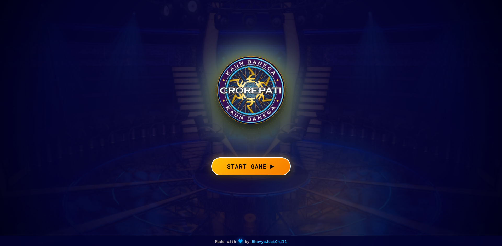
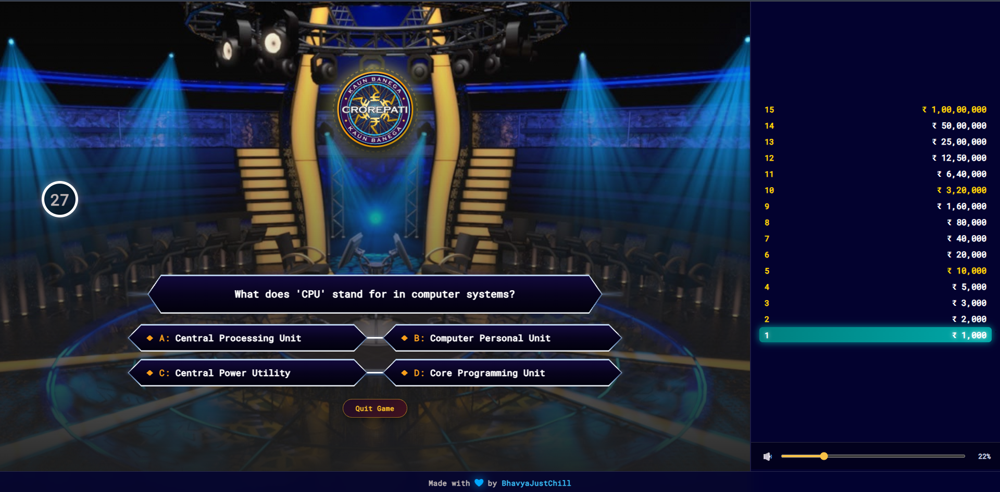
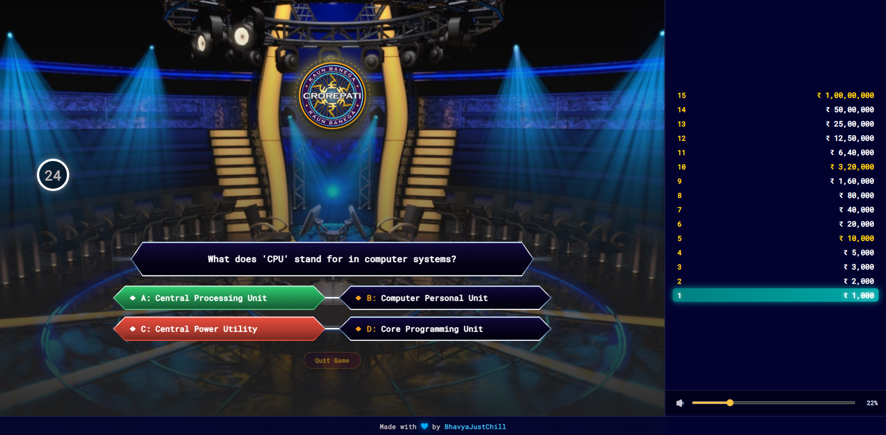
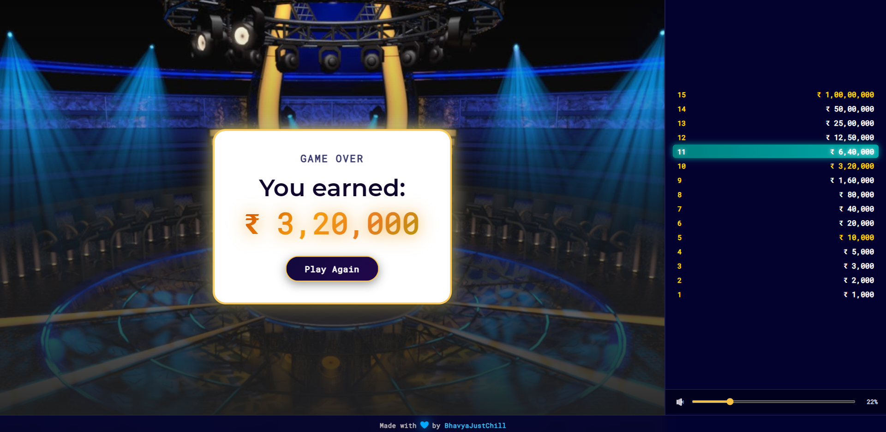
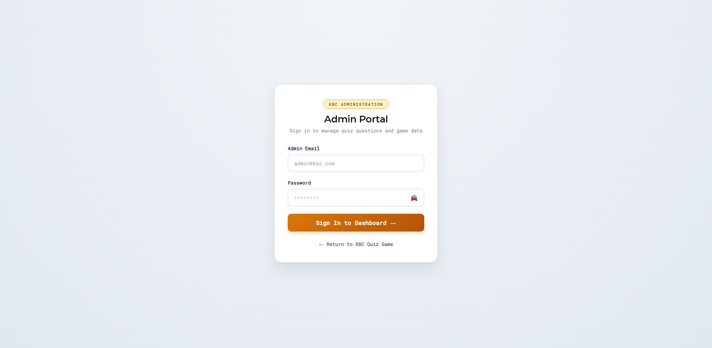
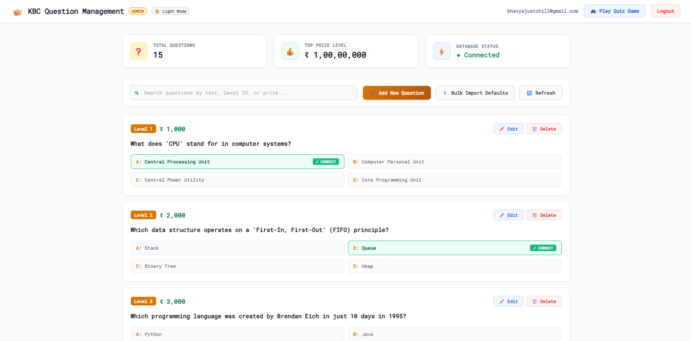

# React KBC Quiz Game

A little KBC Game made using MERN Stack.

## Screenshots













## Features

- [x] User Authentication
- [x] Quiz Gameplay
- [x] Timer
- [x] Score Calculation
- [x] Leaderboard
- [x] Responsive Design

## Tech Stack

- [React](https://reactjs.org/)
- [Express](https://expressjs.com/)
- [MongoDB](https://www.mongodb.com/)
- [Node.js](https://nodejs.org/)
- [Tailwind CSS](https://tailwindcss.com/)
- [Framer Motion](https://www.framer.com/motion/)

## Run Locally

1. Clone the repositories:

```bash
$ mkdir kbc-game
$ cd kbc-game
$ git clone https://github.com/bhavyajustchill/react-kbc-game.git frontend
$ git clone https://github.com/bhavyajustchill/kbc-game-api.git backend
```

2. Run the backend:

```bash
$ cd backend
$ npm install
$ npm run dev
```

3. Run the frontend:

```bash
$ cd frontend
$ npm install
$ npm run dev
```

4. Open [http://localhost:3000](http://localhost:3000) in your browser.

## License

This project is licensed under the MIT License - see the [LICENSE](LICENSE) file for details.

## Author

👤 **BhavyaJustChill**

- GitHub: [https://github.com/bhavyajustchill](https://github.com/bhavyajustchill)
- Portfolio: [https://bhavyajustchill.vercel.app](https://bhavyajustchill.vercel.app/)
